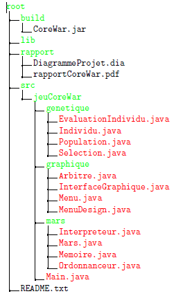
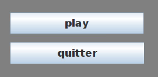
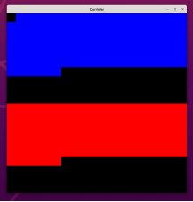
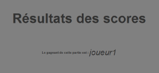
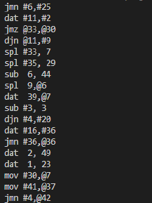

# COREWAR
Ce projet a été réalisé en 2nd années de licence informatique.
Il n'est qu'une courte présentation du projet que l'on a réalisé.
### Présentation projet

Le jeu Core War a été créer en 1984 par D. G. Jones et Alexander Keewatin Dewdney dans
le département informatique de l’université de Western Ontario au Canada. Les règles de jeu
du Core War sont simples, au début d’une partie chaque programme combattant est chargé
dans la mémoire à un endroit aléatoire, puis chaque programme exécute une instruction à tour
de rôle. Le but du jeu est de provoquer l’arrêt des processus des programmes adverses (ce qui se
produit s’ils exécutent une instruction non valide), laissant le programme gagnant seul maître
de la machine.

L’objectif du projet est de fournir un outil permettant de générer des programmes efficace
au Core War avec comme langage imposé le Java. Comme dit précédemment, le Core War est
un jeu de programmation dans lequel deux programmes informatiques sont en concurrence pour
le contrôle d’une machine virtuelle appelée MARS (Memory Array Redcode Simulator). Le but
du jeu est de faire se terminer toutes les instances du (ou des) programme(s) adverse(s).

Dans un premier temps, il a fallu développer une plateforme de simulation de la machine
virtuelle (en utilisant une version simple du langage de programmation appelé RedCode). Dans
un second temps, nous avons dû être capable d’exécuter les programmes écrits en RedCode et
de déterminer le vainqueur. Puis en dernière étape, il a fallu proposer une méthode (construction
aléatoire, système à base de règles ou encore algorithme génétique) permettant d’obtenir
un programme performant.

Ce projet a été réalisé à 3.

---

### Lancement
Pour compiler le programe, laçez la ligne suivante:
	javac -d build src/jeuCoreWar/*/*.java src/jeuCoreWar/Main.java
Pour lancer l'algorithme gégétique, lancez la commande suivante:
	java -cp build jeuCoreWar.Main genetique

 Cette commande vous affiche le code d'un programme selectionné avec un algorithme génétique

Pour lancer une version graphique, lancez la commande suivante:
	java -cp build jeuCoreWar.Main visuel

 Cette commende montre programes très simples s'affronter. Cepandant remarquez qu'il ne peut y avoir de gagnant alor le programe s'arrete après un nombre de tour prédefini

Pour lancer une illustration graphique d'un algorithme génétiquement modifié, lancez la commande suivante:
	java -cp build jeuCoreWar.Main visuelGenetique

 Remarquez que les algorithmes séléctionnés génétiquement pn une tendance générale à devenir des programes détruisant tout sur la mémoire, y compris eux memes

Pour lancer une version console, lancez la commande suivante:
	java -cp build jeuCoreWar.Main console
	
**en cas de problèmes avec les commendes de compilation, veillez utiliser le ficher.jar présent dans le dossier build   en remplaçant les instructions suivantes :**
(Parametre étant soit: visuel, visuelGenetique, genetique ou encore console)

java -cp build jeuCoreWar.Main PARAMETRE

par

java -jar build/CoreWar.jar PARAMETRE

---

### Répartition des packages, fichiers
Pour ce qui est de la répartition de nos dossiers, packages et fichiers différents, voici une
représentation de comment nous les avons disposer:

#### Cohérence des éléments

Pour les packages, nous nous sommes assurer qu’ils ont des noms cohérents, clairs et qui
reflètent leur contenu et leur objectif dans le projet.

Nos classes ont un nom approprié et représentent clairement leur rôle dans le projet. Par
exemple la classe Arbitre dans le package graphique, on sait qu’on auras potentiellement des
informations sur la partie et du vainqueur de ce dernier.

Il est également important que les fichiers contenus dans chaque package soient cohérents
et pertinents. Par exemple toujours dans le package graphique, les éléments qui affiche sur la
partie graphique sont dans ce dernier, alors que dans le package mars, aucun fichier affiche quoi
que ce soit sur la partie graphique.

Il en va de même pour nos méthodes et nos variables qui ont des noms clair, représentent
au mieux leur rôle dans le contexte de la classe qui les contient.

---

### Partie Graphique

#### Le menu
La partie graphique comprend trois parties, la première étant le menu principal, c’est là où
le joueur peut quitter le jeu ou de lancer ce dernier avec un choix de la grille.
La seconde c’est le jeu en lui même, où nous pouvons apercevoir les programmes s’afffronter. Et en dernière partie,
c’est l’affichage du nom du vainqueur de la partie.

Les fichiers qui font partie de la partie graphique sont les suivants :
- InterfaceGraphique.java
- Menu.java
- MenuDesign.java
- Arbitre.java

Le menu comporte 2 bouttons qui sont respectivement "play" et "quitter" (voir figure 2),
et d’une liste déroulante qui sont chacun definis dans la classe MenuDesign qui
est instancié dans la classe Menu.

En effet c’est la classe Menu qui gère les différentes classes de la partie graphique grâce à
un cardLayout qui permet de changer de fenêtre en fonction des actions de l’utilisateur.
Le boutton "play" change le JPanel actuel en JPanel de la classe InterfaceGraphique grâce
au CardLayout. Le boutton "quitter", comme son nom l’indique quitte le jeu, il permet la
fermeture de la fenêtre.

Pour ce qui est du choix de la grille qui est une JComboBox, elle permet à l’utilisateur de
choisir la taille de la grille entre des valeurs prédéfinies qui sont 100 et 400. Nous avons choisi ces
2 tailles comme possibilité de selection car les autres tailles ne donner pas le résultat voulu. En
effet, en faisant la racine carrée de ces deux valeurs on tombe sur des entiers sans avoir besoin
de les arrondir, ce qui nous a enlevé une épine du pied pour régler des problèmes d’affichages,
puisque avant cela nous perdions une partie de notre affichage du jeu.

#### Le jeu

La partie du jeu graphiquement est représenté par la class InterfaceGraphique qui affiche
une grille selon la taille choisit par l’utilisateur.
Elle fait appelle a l’ordonnanceur pour récuperer les instructions des 2 joueurs, enfin ce n’est
pas vraiment les instructions qui sont récupéré mais une liste comprenant la position de la case
et la couleur du joueur. En effet on change la case récuperé en fonction du joueur récupéré, si
c’est le joueur 1 on met la case en bleu et si c’est le joueur 2 on met la case en rouge). Il est important de préciser que le tableau commence en étant rempli de case noir, les cases
noir correspondent a des cases qui n’on pas encore eu de changement.

#### Arbitre

L’affichage de la partie arbitre nous est parvenue uniquement lorsque la partie est terminé,
c’est-à-dire lorsqu’un gagnant est déclaré et ceci se produit dès lors que l’entièreté des processus
des programmes d’un des 2 joueurs soient arrêter. Voici une représentation de l’affichage de
l’arbitre sur la partie graphique.

Il est en effet important de montrer au joueur qui c’est qui a gagné, c’est pour cela qu’on a
décidé de faire cette classe au lieu de rien n’avoir.

---

### Partie non Graphique

C'est le coeur du projet mais elle n'est pas présenté ici.

Ceci n'est qu'un example d'individu que chaque utilisateur doivent créer pour pouvoir faire confronter leur instructions.

---

### Maintenabilité et évolution facile du code

#### Redondance

Il n’y pas de redondance dans nos programmes puisque nous avons fait de notre mieux pour
en éviter au maximum.

#### Robustesse

Comme mentionné précédemment, notre code est organisé selon 3 packages, chacun des
packages a été construit de manière quasi indépendantes, ce qui veut dire que chaque partie est
suffisamment robuste, les défauts de cette méthode sont les liens entre les parties qui peuvent
être plus enclins à la casse, c’est pourquoi nous y avons apporté une attention particulière.

#### Conception

La partie graphique est facilement modifiable et améliorable. En effet, il est très facile
par exemple de modifier la taille de la grille ou encore de changer la couleur des cases. Il
est également possible d’ajouter des fonctionnalité sans trop de problème bien que la partie
graphique se base sur la partie non graphique.

### Conclusion

#### Les côtés négatifs
- On n’a pas assez testé nos fonctions, ce qui peut engendrer de potentielle faille, oublie.
#### Les côtés positifs
- La possibilité de choisir entre plusieurs taille de grilles.
- Nos instructions sont implémentés.
- L’algo génétique est mis en place et modifiable très facilement.
#### Les choses qui peuvent être améliorer
- On aurait voulu avoir d’avantage de taille disponible a l’affichage mais cela n’a pas été
possible puisque la grille dépasse la fenêtre pour la grande majorité des tailles testé.
- On aurait également voulu ajouter le suivi des pointeurs via un affichage graphique mais
cela n’a pas été implémenter bien que cela devrait être ajoutable sans trop de difficulté.
- Intégrer le MVC à notre projet, malheureusement on l’a penser trop tard et cela aurait
été compliqué de faire un MVC à la va vite, c’est pourquoi on ne la pas intégré. Mais
cela dit son intégration aurait permis d’avoir une actualisation de l’affichage graphique
facilement tout en étant performant.
- Afficher les détails de la partie lors de la fin de cette dernière, c’est-à-dire avoir des
informations en plus telles que le nombres de processus qui fut créer, détruit et combien
de temps à durer la partie par exemple.
Mais néanmoins nous restons satisfait du résultat, des efforts apporté au projet Core War
tout au long de ce semestre.